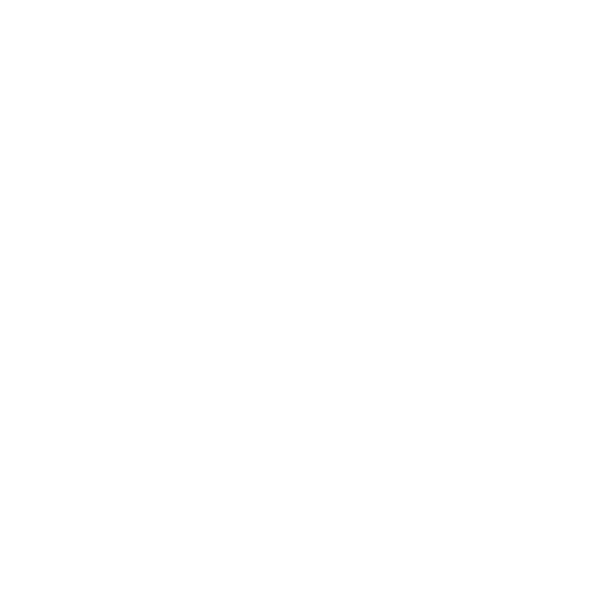

# Shoulders: Next Seed

<div display="flex" align="center" justify="space-between" flex="auto">


<p align="center">A smart organization that aims to facilitate the understanding of complexity</p>
<br>
<br>

<a href="http://nextjs.org/" target="blank"></a>

  <p align="center">Next.js gives you the best developer experience with all the features you need for production: hybrid static & server rendering, TypeScript support, smart bundling, route pre-fetching, and more.</p>
</div>  
    
<br><hr>

## Description

🚀 This is a seed to start a NextJS application easily with useful features already configured!

_You can use our <a href="https://github.com/Eureka-Shoulders/nest-seed" target="_blank">Nest Seed</a> to improve your application_

<hr>

### Our Features:

- Authorization
- Authentication
- Recover password
- Cookies
- eslint and prettier configured
- Shoulders Libs:
  - Fetchx
  - Formix
  - Formuy
  - Componentz
  - Beltz
- Resources
  - Users
  - People
    - Roles
    - Contacts

<hr>

## Installation

```bash
yarn install
```

## Running the app

**Not necessary if the application was started with docker in the above command**

```bash
# development
$ yarn dev

#build
yarn build
yarn start

```

## Support

More info soon

## License

Nest is [MIT licensed](LICENSE).
